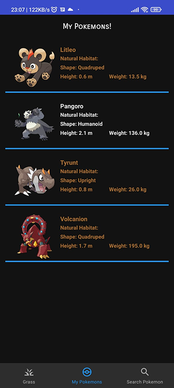

# Pokedex

Creating a Pokedex App to study.

# Overview

* Arquitetura utilizada foi `MVVM`, sendo ela a recomendada pela Google, pois permite uma melhor
  separação de responsabilidades das peças do projeto, dividindo ele em:

-
    - `Repositório` - responsável por buscar informações, localmente ou online.
-
    - `ViewModel` - lógica de negócio e tratamento de dados.
-
    - `View` - apresentação de informações para o usuário.

* Consumo da API, foram utilizadas algumas bibliotecas, o `Retrofit` junto com `OKHTTP` e `Gson`
  para conversão dos dados.

* A persistência dos dados foi feita utilizando o `Room`.

* Para exibir as imagens a partir de uma URL foi utilizada a biblioteca `Glide`.

* Apresentação de dados reativos utilizando `Flow` e `LiveData`.

* Paginação de dados (tela inicial) feito com `Paging3`

# Features:

* Listagem de Pokemons (aproximadamente 900 pokemons fornecidos pela API)
* Detalhes dos Pokemons (nome, atributos, tipos, habilidades, locais onde é encontrado, cor, textos descritivos)
* Pokemons Favoritos
* Enviar informações de Pokemons favoritos
* Buscar Pokemons por nome ou ID.

# Images:
**Feature: Listagem e Detalhes**

 

**Feature: Pokedex (Favoritos)**

 

**- Feature: Enviando informações**

 

**Feature: Procurar Pokemon**

  

# API Rest:

* [PokeApi](https://pokeapi.co/docs/v2#pokemon)

# Used libraries:

* [Hilt](https://developer.android.com/training/dependency-injection/hilt-android)
* [Room](https://developer.android.com/jetpack/androidx/releases/room)
* [Paging](https://developer.android.com/topic/libraries/architecture/paging/v3-overview)
* [Retrofit](https://square.github.io/retrofit/)
* [OkHttp](https://square.github.io/okhttp/)
* [Glide](https://bumptech.github.io/glide/)
* [Lottie](https://airbnb.io/lottie/#/android)
- - [Man Walking Animation](https://lottiefiles.com/79727-man-walking)
